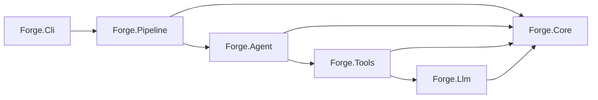

# Forge documentation

Forge is a .NET 9 CLI for running tool-using LLM agents against an OpenAI-compatible (LiteLLM) endpoint. There is no user-facing pipeline surface — every run is a single agent.

## Agent fast-path

Before reading layer docs, try these in order:
1. **Known code path?** `py ~/.claude/skills/docs-maintainer/scripts/context.py resolve docs/ <src/path>` — returns the docs covering that file/folder.
2. **Known task archetype?** Check [`recipes/`](recipes/) — pre-curated reading + action lists.
3. **Machine consumer?** Parse [`.manifest.json`](.manifest.json) — reverse index of `code_refs → docs`.

The sections below are the fallback for open-ended exploration.

## Architecture

`Forge.Pipeline` is now an internal one-stage runner used by `forge agent` and `forge resume`; it is not exposed via the CLI.

## Domain (feature-based)
- [agents](Domain/agents.md) — `AgentConfig`, invariants, synthetic `submit_final` [src/Forge.Agent/]
- [tools](Domain/tools.md) — `ITool` contract, the seven built-ins, `bash` mounts [src/Forge.Tools/]
- [runs](Domain/runs.md) — `RunState`, run id, `AsStateJson` [src/Forge.Core/Types/, Workspace/]

## Application (feature-based)
- [AgentRunner](Application/AgentRunner.md) — tool loop, `submit_final`, diff verification, termination [src/Forge.Agent/AgentRunner.cs]

## Presentation (feature-based)
- [cli](Presentation/cli.md) — every command, option, exit code [src/Forge.Cli/]

## Infrastructure (concern-based)
- [llm-client](Infrastructure/llm-client.md) — LiteLLM HTTP client + `~/.forge/llm.json`
- [logging](Infrastructure/logging.md) — stderr contract + trace events
- [plugins](Infrastructure/plugins.md) — agent + skill discovery order
- [project-context](Infrastructure/project-context.md) — `AGENTS.md` / `CLAUDE.md` injection

## Data (concern-based)
- [workspace](Data/workspace.md) — `{forgeHome}/runs/<id>/` artifact layout

## ADRs
- [001 Own the tool loop](adr/001-own-the-tool-loop.md)
- [002 JSON at every boundary](adr/002-json-at-every-boundary.md)
- [003 Single LiteLLM endpoint](adr/003-litellm-single-endpoint.md)
- [005 Trace event schema](adr/005-trace-event-schema.md)

## Recipes
- [add-built-in-tool](recipes/add-built-in-tool.md) — new `ToolBase<TIn,TOut>` + registration
- [add-cli-command](recipes/add-cli-command.md) — new Spectre command + wire-up
- [add-trace-event](recipes/add-trace-event.md) — new `TraceEvent` record + call sites
- [fix-agent-loop-bug](recipes/fix-agent-loop-bug.md) — debug the `AgentRunner` loop

## Conventions
- [csharp-conventions](csharp-conventions.md) — type shape, `required`/`init`, data-type record rule
